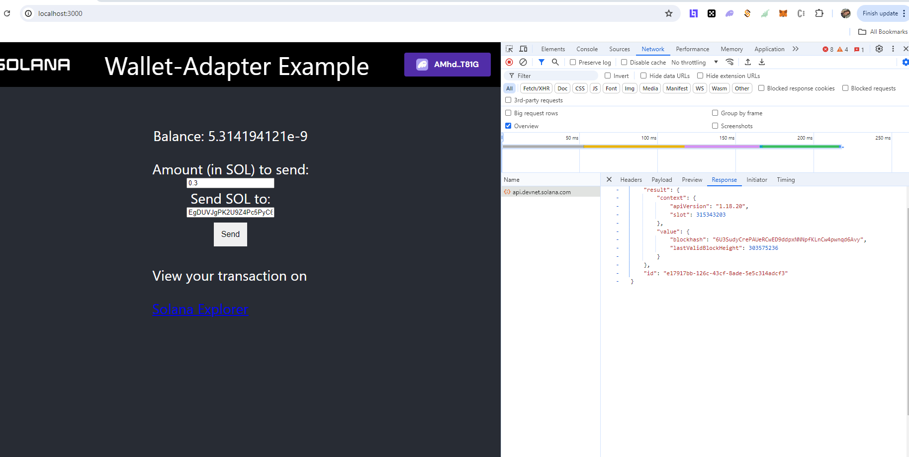
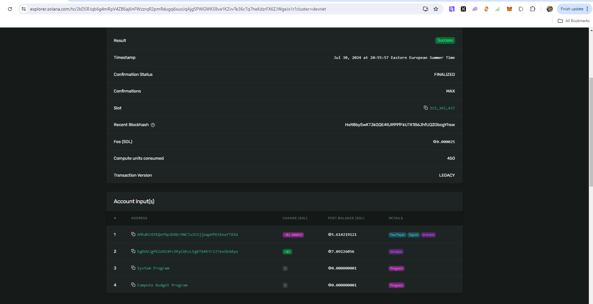

# Solana Developers Program

The First Romanian Solana Developer Program 🇷🇴

## .env

Rename `.env.local` to `.env` and fill in the SECRET_KEY with the contents of your private key.

## Solana Ping Frontend app

- This app aims to create an UI app with React which interacts with a Phantom wallet and sends SOL to another SOL account.

---- 

### UI after sending SOL

### Solana Explorer for transaction [here](https://explorer.solana.com/tx/2kDSRJqb6g4mRpV4ZB6aj6nFWzzrqR2pmRdugq6xuoJqAjg5PWGWKS8va1KZvvTe36c7q7heKdzrFX6ZJWgeJx1r?cluster=devnet)

