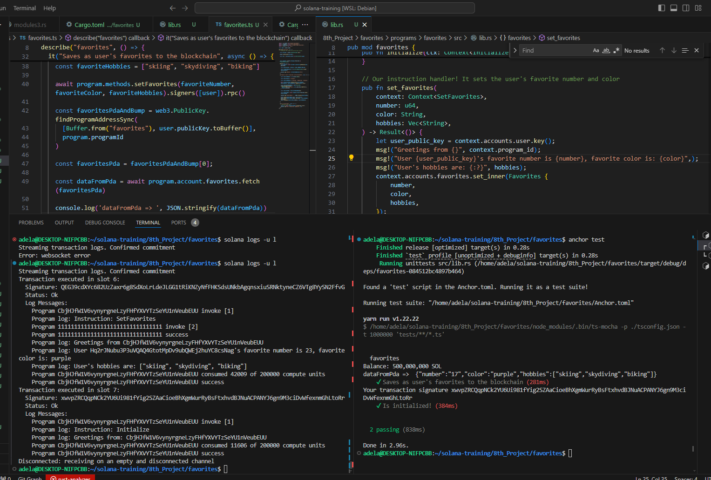

## ONCHAIN PROGRAMMING

#### Solana Program

- This Solana program allows users to set and store their favorite number, color, and hobbies on the blockchain. It includes two main instructions: initialize and set_favorites.
---- 
- Initialization: The initialize function logs a greeting message with the program ID.
---- 
- Set Favorites: The set_favorites function allows users to store their favorite number, color, and hobbies. The information is stored in an account associated with the user's public key.
----
- The Favorites struct stores the user's preferences and is initialized with a specified size to accommodate the data. The SetFavorites struct ensures that only the user can update their preferences.
----

**Test results:**
> anchor test
---
